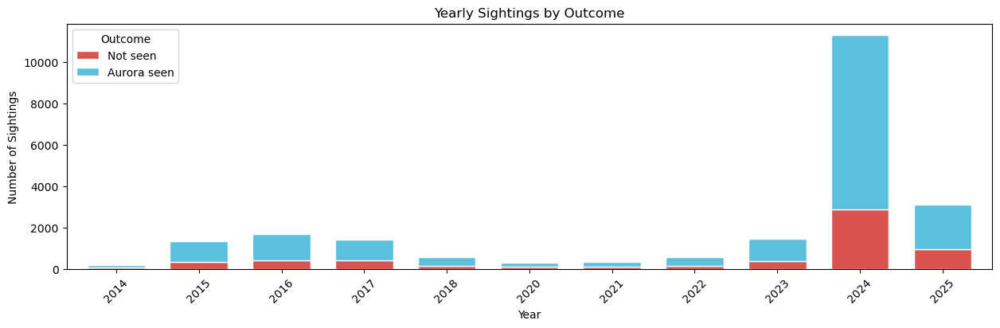
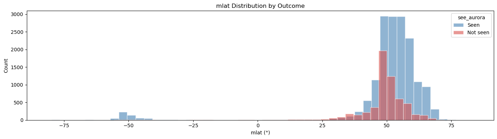

# Aurora Visibility Prediction

## Overview

This project builds a classification model to predict whether auroras will be visually observable from a specific geographic latitude given geomagnetic and local-sky conditions. Given the following key features for a particular time and location, predict a binary label: visually observable (yes/no).

- Kp index: global geomagnetic activity (0–9)
- Solar wind speed: km/s
- Bz IMF: Bz component of the interplanetary magnetic field (nT)
- Solar elevation angle
- Moon darkness index
- Cloud percentage cover: local cloudiness (%)

The goal is to provide a short-term forecast for observers, helping photographers, astronomers, and aurora enthusiasts plan observations.


## Data
Tabular list of data sources, access methods, licensing, and limitations: [`aurora_data_pipeline.ipynb`](aurora_data_pipeline.ipynb) 
1. Actual aurora observations reported by citizens from 2014-2025, submitted to the Aurorasaurus citizen science project: available at https://zenodo.org/records/16783265
2. Space-weather data: file fetched from: [https://omniweb.gsfc.nasa.gov/form/dx1.html](https://spdf.gsfc.nasa.gov/pub/data/omni/low_res_omni/). Contains 3-hourly measurements of Kp, solar wind speed, and Bz for the complete duration of the Aurorasaurus data collection period.
3. Local weather data: file fetched from: https://open-meteo.com/en/docs/historical-forecast-api?hourly=cloud_cover, cached for ease of access.

## Data acquisition scripts
Preprocess raw data from space and earth weather, to produce a cleaned and merged dataset ready for feature engineering.

Running this script:
```
aurora_data_pipeline.ipynb
```
produces the processed dataset: `aurora_dataset_clean.csv using the Aurorasaurus data (originally named: [data/raw/web_observations_2014-08-01_to_2025-08-02_cleaned.csv](web_observations_2014-08-01_to_2025-08-02_cleaned.csv) renamed for convinience to [aurora_sighting.csv](aurora_sighting.csv)) and the open-meteo weather data in [aurora_weather.csv](aurora_weather.csv).

We use `see_aurora` as our target variable, which contains a boolean value (True or False) reported by the observer.

## Observations from exploratory data analysis
- Out of 22,280 observations 73.5% report positive sighting and 26.5% report no aurora seen.
  
- Of the positive sightings 62.5% also report images taken (image not included in the dataset).
- Aurora sightings went up in 2024 conciding with the solar cycle peaking. That also reflects on a larger number of negative sightings, consistent with higher overall reportings of any such events.
- Aurora occurence is dependent on the magnetic latitude of the location.
  
- 31.1% of the positive sightings had local cloud cover > 80% according to open-meteo weather source at the location latitude, longitude, date and time.
- 32.3% of the positive sightings had sun above the horizon (sun elevation angle $> 0^{\degree}$) computed analytically at the observer's exact lat/lon and UTC datetime using the [astral](https://astral.readthedocs.io/en/latest/package.html) library.

  
 ## Two apporoaches to modelling
- [Model 1](modeling_xgbclassifier.ipynb): 2 stage XGBoost claissifer where the first model focuses on geomagnetic features with acitivity_id (quiet, active, very active). The predicted probability (p_thershold) acts as feature of the second XGBoost classifier with added weather features to make final predictions. 
- [Model 2](model_EBM.ipynb): Leverage the mlat feature to create low, mid, high mlat bands and employ ExplainableBoostingClassifier. Train data split in timeseries with leave-one-region-out (in mlat) cross validation strartegy per fold. Added features in terms of auroral oval distance and also possible interaction terms between geomagnetic indices. mlat band specific positive/negative weight imbalance addressed by sample reweighting. The model's predicted probability of observing an aurora for a representative value of Kp = 7, assuming realistic values for the other geomagnetic indices and clear night-sky conditions, is shown [here](plots/aurora_globe_kp7.png).

## Outcome
The model predicts where observers will actually see aurora, accounting for observer distribution, cloud cover, darkness and the underlying geomagnetic indices. The second model is performing well in the high mlat regions where aurora sighting chances are higher even in quiet solar storms.


[Explore the Interactive Aurora Prediction Map](https://erdos-projects.github.io/summer26-aurora-visibility-predictions/plots/aurora_prediction_map.html)
